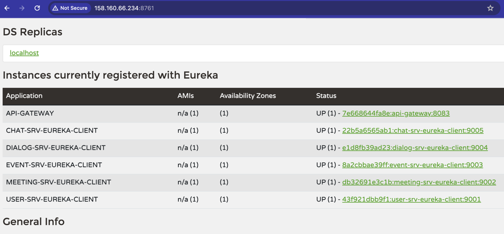
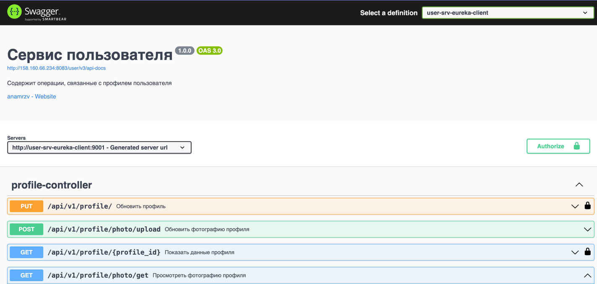

- Микросервисы регистрируются в [Eureka](https://spring.io/projects/spring-cloud-netflix).
- Микросервисы подтягивают конфигурацию из [Config-Server](https://spring.io/projects/spring-cloud-config).
- Микросервисы доступны через [Spring Gateway](https://spring.io/projects/spring-cloud-gateway).
- Для взаимодействия между микросервисами используются Feign Client и в некоторых случаях вебсокеты.
- Внедрен [Circuit Breaker](https://cloud.spring.io/spring-cloud-netflix/multi/multi__circuit_breaker_hystrix_clients.html).
- В некторые микросервисы внедрен Reactor
- Реализована работа с уведомлениями: на почту, указанную при регистрации, приходит ссылка для подтверждения регистрации
- Реализована загрузка и получение файлов (аватар пользователя)
- Для реализации микросервисов использовуются очереди сообщений RabbitMQ.
- Добавлена интерактивная документация с помощью OpenApi 3.
- Развернут Swagger, в котором будет хранится документация API системы (всех микросервисов).
- Развернут CI/CD с использованием GitLab

Перед запуском сервисов:
- Заполнить БД roles тремя записями: ROLE_ADMIN, ROLE_ADULT, ROLE_USER
- В application.yml сервиса пользователей (user_srv) указать параметры spring.mail.username и spring.mail.password

